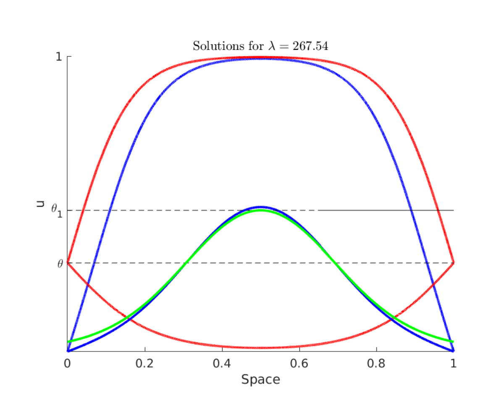

# Control of reaction-diffusion under state constraints: Barriers

This tutorial is focused on the understanding of of the problem

$$-\Delta u=f(u) \qquad x\in\Omega$$
$$ 0< u< 1 \qquad x\in\Omega$$
$$ u=a\in\{0,\theta\} \qquad x\in\partial\Omega$$

The solutions for $a=0$ constitute an instrisic obstruction to the controllability with state-constraints due to the comparison principle [1]. Indeed, for any control function $0\leq a(x,t)\leq 1$
the solution of the problem:

$$v_t-\Delta v=f(v) \qquad x\in\Omega\times(0,T)$$
$$ v=a(x,t) \qquad x\in\partial\Omega\times(0,T)$$
$$ v(x,0)\geq u \qquad x\in\Omega$$

where $u$ is an elliptic nontrivial solution satisfies that $v(x,t)\geq u(x)$. Therefore, we cannot expect to control to any function below $u$.

This is why the understanding of the existence or non-existence of nontrivial solutions is of main importance for the controllability under state-constraints.

Non-trivial solutions around the boundary value $a=\theta$ do not constitute an intrinsic obstruction to the controllability because the boundary value $\theta$ is not in the border of the admissible set. However, the existence of such solutions create a technical difficulty for achieving the controllability to the steady state $w\equiv \theta$ which can be solved by constructing paths of steady states (see [PathsSS]).

Elliptic nontrivial solutions with boundary value 1 do not exist. This can be related to the fact that the traveling waves for the Cauchy problem in the real line are approaching the steady state $w\equiv 1$ [2]

The existence of non-trivial solutions can be done either by comparison principles or by understanding the critical points of a functional (see [3]).

Any critical point of the functional:

$$J: H^1_0\to  \mathbb{R}$$
$$J(u)=\int_\Omega \frac{1}{2}|\nabla u|^2-\int_0^uf(s)ds dx$$

is a weak solution of the main equation. 

In order to guarantee that the solution will be between $0$ and $1$, one can extend $f$ by $0$ outside of the interval $[0,1]$.

Restricting ourselves in the one dimensional case (the argument also holds in several dimensions) and making the spatial change fo variables $x\to \frac{x}{L}$, where $L$ is the length of the domain the functional reads:

$$J(u)=\int_0^1 \frac{1}{2}| u_x|^2-L^2\int_0^uf(s)ds dx$$

In the expresion above we see that if $L$ is small the convex part dominates while if $L$ is large and $\int_0^1f(s)ds>0$ it might not be convex.

In the videos below one can see the evolution of the functional depending on the parametar $\lambda=L^2$. The representation is the evaluation of the functional along the first and the third eigenfunction, i.e. $e_1=\sin(\pi x)$ and $e_3=\sin(3\pi x)$.

Here, one can see the evolution of the functional for $a=0$ and for $a=\theta=1/3$

Extension to a ball.

Extension to a ball.

In the next figure a qualitative bifurcation diagram is represented, the red curve represents the nontrivial solutions with boundary value $\theta$ and the blue one the boundary value $0$. $\lambda^*$ is the minimum $\lambda=L^2$ for which a nontrivial solution around $0$ exists, analogously $\lambda^*_\theta$.

Extension to a ball.

Here one can see different non-trivial solutions for different boundary values. The green curve corresponds to a section of the nontrivial solution in the whole $\mathbb{R}$.

Extension to a ball.

## References:

[1] M.H. Protter and H.F. Weinberger, Maximum principles in differential equations, Springer Science & Business Media, 2012.

[2] D.  Ruiz-Balet  and  E.  Zuazua. Control of certain parabolic models from biology and social sciences.   Preprint  available  at https://cmc.deusto.eus/domenec-ruiz-balet/.

[3]  P.L. Lions, On the existence of positive solutions of semilinear elliptic equations, SIAM Rev. 24 (1982), no. 4, 441–467.
  
