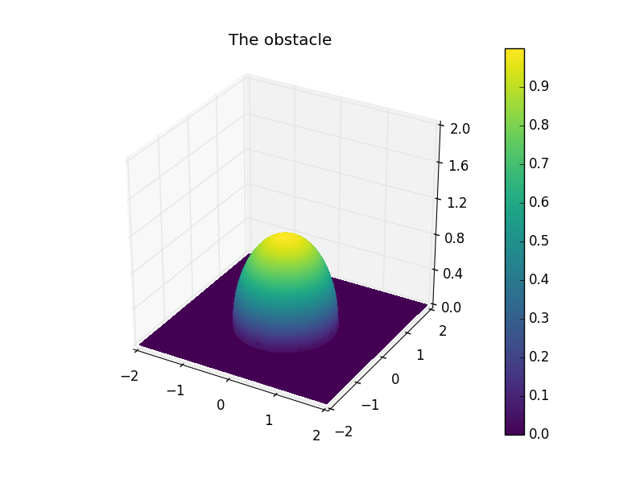
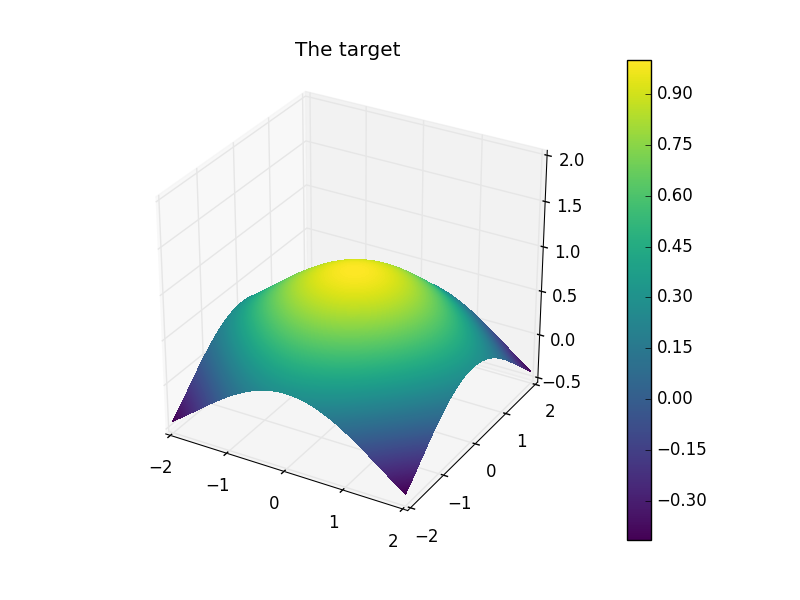

# Optimal Control of the Obstacle Problem

 

A sample state of the parabolic obstacle problem.

In this tutorial, we will present how to numerically solve and implement optimal control strategies for the elliptic and parabolic obstacle problems using the `FEniCS` Finite Element toolbox and the `dolfin-adjoint` optimization package [1, 2, 3]. 

## _Mathematical formulation_

Fix $\Omega \subset \mathbb{R}^2$ and an obstacle $\psi \in H^2(\Omega)$.  Denote by $K_\psi$ the convex subset of $H^1_0(\Omega)$ consisting of all functions $\geq \psi(x)$. 

The elliptic obstacle problem takes the form: find $y \in K_\psi$ such that
$$(\nabla y, \nabla v-y)_{L^2(\Omega)} \geq  (f+u, v-y)_{L^2(\Omega)} \quad \forall v \in K_\psi.$$
Here $f \in L^2(\Omega)$ is a given auxiliary forcing (may be $0$) and $u \in L^2(\Omega)$ represents the control.

Similarly, the parabolic problem reads: find $y \in L^2(0, T; K_\psi) \cap H^1(0, T; L^2(\Omega))$ such that
$$(y_t(t) v-y(t) )_{L^2(\Omega)}+ (\nabla y(t), \nabla (v-y(t)) )_{L^2(\Omega)} \geq  (f+u(t), v-y(t))_{L^2(\Omega)} \quad \forall v \in K_\psi$$
for $t \in (0, T)$, and $y(0, \cdot) = y_0$. Once again, $f$ designates an auxiliary forcing and $u = u(t,x)$ the control, which may now be time-dependent. 

We will be interested in minimizing the tracking-type functional
$$ J(u, y) = \frac12 \| y - y_d \|_{L^2(\Omega)}^2 + \frac{\delta}{2} \| u \|_{L^2(\Omega)}^2$$
over all controls $u$ where $y$ is the associated solution to the elliptic problem and $y_d \in L^2(\Omega)$ is the target, and similarly 
$$ J(u, y) = \frac12 \| y-y_d\|_{L^2(0, T; \Omega)}^2 + \frac{\delta}{2} \| u \|_{L^2(0, T; \Omega)}^2$$ 
for the parabolic case, where $y_d$ may be a time-dependent target. In both functionals, $\delta>0$ is a small parameter which filters controls of large norm (Tikhonov regularization).

## _The elliptic problem_

Preview of the obtained optimal state and control.

We concentrate a large part of the numerical implementation on the elliptic problem, as it may be transferred to the parabolic problem by time-stepping. Both of the above problems admit a unique solution [4, 5]. Nevertheless, there are some difficulties to be considered when solving the problem numerically, namely because the problems are not differentiable (the solution map for the obstacle problem is only Lipschitz continuous [6]). Following [4], we mend this issues in the next section by penalizing, a common approach for solving variational inequalities.

We use the approximation
$$ (\nabla y, \nabla v)_{L^2(\Omega)} + \frac{1}{\epsilon} (\max(y-\psi, 0), v)_{L^2(\Omega)} = (f+u, v)_{L^2(\Omega)}$$
for all $v$ where $\epsilon>0$ is the penalty parameter. It yields solutions which converge to the solution of the variational inequality as $\epsilon\rightarrow 0$ [7]. In fact, this is the de facto strategy for proving the well-posedness of the obstacle problem (in both settings).
To apply a gradient-based optimisation method, we need differentiabilty, thus the non-smooth max operator is replaced by a differentiable ($C^1$) approximation.

 Regularization of the penalty function. 

While we may treat complex geometries and obstacles using the `FEniCS` toolbox, we restrict ourselves to $\Omega = [-2,2]^2$ and the obstacle $\psi(x) = (1-x^2)\chi_{B_1}$ in this tutorial.

The obstacle and the target profile.

In the elliptic case, the target is given by $y_d(x) = \frac12(\cos(x)+\cos(y))$.

### Implementation

We begin by importing the necessary libraries. The `fenics` module contains all of the necessary finite element tools for the space discretization of PDEs. The syntax is symbolic and one uses the pre-defined FEniCS objects, including `FunctionSpace` (for the finite element space), `Function` (for the unknown state and control) etc.
The `dolfin_adjoint` module contains the library wherein the adjoint optimization methodology is fully automatized (using automatic differentiation) provided the forward model.

    from fenics import *
    from fenics_adjoint import *
    from obstacles import dome

We define the smooth approximation of the max.

    def smoothmax(r, eps=1e-4):
	    return conditional(gt(r, eps), r-eps/2, conditional(lt(r, 0), 0, r**2/(2*eps)))

We mesh the domain $[-2,2]^2$ in $16384$ elements. 

	mesh = RectangleMesh(Point(-2,-2), Point(2,2), 128, 128)

$P1$ elements are used for the FEM spaces (but one may easily choose higher order in the definition of V = Vh).

	V = FunctionSpace(mesh, "CG", 1)
    y = Function(V, name="State")
    u = Function(V, name="Control")
    w = TestFunction(V)
    psi = interpolate(dome(degree=4), V)
	f = Constant(0.1)		
    alpha, eps = 1e-4, 1e-6
    yd = interpolate(Expression("0.5*(cos(x[0])+cos(x[1]))", degree=2), V)

Using the symbolic expressions of `FEniCS`, we define the variational formulation of the penalized PDE:

	bc = DirichletBC(V, 0.0, "on_boundary")
    F = inner(grad(y), grad(w))*dx - 1/eps*inner(smoothmax(-y+psi), w)*dx - inner(f+u, w)*dx
    solve(F == 0, y, bcs=bc)

A "tape" of the forward model is built. This tape is used to drive the optimization by repeatedly solving the forward model and the adjoint model for varying control inputs. Since the problem is nonlinear, a Newton method is used by the command `solve`.

We finish by defining the objective functional to be minimized:

    delta = Constant(1e-2)
    j = assemble(0.5*inner(y-yd, y-yd)*dx + delta/2*inner(u, u)*dx)	
    m = Control(u)

Writing the state $y$ as the output of the solution map corresponding to the input $m$, one sees that the objective functional depends only on the control: 

    J = ReducedFunctional(j, m)									

We run the optimization (the default solver is the Broyden–Fletcher–Goldfarb–Shanno (L-BFGS-B), but a wide selection of methods is available):

    u_opt = minimize(J, options={"maxiter": 15, "gtol": 1e-6, "ftol": 1e-100})

The tape is modified such that the initial guess for y (to be used in the Newton solver in the forward problem) is set to y_opt.

    y_opt = y.block_variable.saved_output
    Control(y).update(y_opt)

We postprocess using `Paraview`.

    psipvd = File("elliptic/psi.pvd")
	ypvd = File("elliptic/y_opt.pvd")
	upvd = File("elliptic/u_opt.pvd")
	ydpvd = File("elliptic/yd.pvd")
	
	ypvd << y_opt
	upvd << u_opt
	ydpvd << yd
	psipvd << psi

The following figures allow us to conclude that the optimal state does indeed satisfy the obstacle constraint.

The algorithm converged after 8 iterations, and the value of the functional at the final iteration is $0.0967$.

## _The parabolic problem_

### Implementation

We only sketch the important steps, and the full code may be found in the attached files. The same penalization function is used, thus the penalized problem reduces to a parametrized semilinear heat equation. Following the same meshing and element setting as above, we define the required data and parameters.

    data = Expression("1-(-0.3*t+0.85)*(x[0]*x[0]+x[1]*x[1])", t = 0, degree = 4)
	T, dt = 2, Constant(0.1)

We will store the control as a `Python` dictionary to keep the time ordered.
For each time, the control $u(t)$ will be a function.

    ctrls, t = OrderedDict(), float(dt)
    while t <= T:
	    ctrls[t] = Function(V)
	    t += float(dt)

As the problem is more complex, it is convenient to build a solver for the forward problem. Given a control, we solve the parabolic obstacle problem and also construct the tracking part of the functional using the computed state.

    def solve_parabolic(ctrls, epsilon):
		...
		y_n = Expression("1-0.85*(x[0]*x[0]+x[1]*x[1])", degree=3)
		y_n = interpolate(y_n, V)

		F = y*v*dx + nu*dt*dot(grad(y), grad(v))*dx - dt/epsilon*dot(smoothmax(-y+psi), v)*dx - (y_n + dt*(f+0.1))*v*dx
		bc = DirichletBC(V, 0.0, "on_boundary")	

		t = float(dt)
		j = 0.5*float(dt)*assemble((y - yd)**2*dx)
		...
		while t <= T:
			f.assign(ctrls[t])
			data.t = t
			yd.assign(interpolate(data, V))
			solve(F==0, y, bcs=bc)
			if t > T - float(dt):
				weight = 0.5
			else:
				weight = 1
			j += weight*float(dt)*assemble((y - yd)**2*dx)
			vtk_sol << (y, t)
			vtk_data << (yd, t)
			t += float(dt)
		return y, yd, j

We set the tape.

	epsilon, delta = Constant(1e-4), Constant(1e-2)					
	y, yd, j = solve_parabolic(ctrls, epsilon)

We build the objective functional.

	reg_u = delta/2*sum([1/dt*(fb-fa)**2*dx for fb, fa in
     	zip(list(ctrls.values())[1:], list(ctrls.values())[:-1])])
	J = j + assemble(reg_u)
	m = [Control(c) for c in ctrls.values()]
	rf = ReducedFunctional(J, m)

We now run the optimization procedure.

	opt_ctrls = minimize(rf)

Once the optimal control computed, we solve the forward problem with it to obtain the optimal state.

	dico = OrderedDict()
	s, i = float(dt), 0
	while s <= T:
    	dico[s] = opt_ctrls[i]
    	i+= 1
    	s += float(dt)
	new_y, new_yd, new_j = solve_parabolic(dico, epsilon)

 The state and the target, tracked throughout. 

The constraint $y\geq \psi$ is satisfied, which is why the optimal state does not lift off sharply.

## References:

[1] The FEniCS Project Version 1.5
M. S. Alnaes, J. Blechta, J. Hake, A. Johansson, B. Kehlet, A. Logg, C. Richardson, J. Ring, M. E. Rognes and G. N. Wells
Archive of Numerical Software, vol. 3, 2015.

[2] Patrick E. Farrell, David A. Ham, Simon W. Funke and Marie E. Rognes (2013). Automated derivation of the adjoint of high-level transient finite element programs, SIAM Journal on Scientific Computing 35.4, pp. C369-C393. doi:10.1137/120873558. arXiv:1204.5577

[3] Simon W. Funke and Patrick E. Farrell (2013). A framework for automated PDE-constrained optimisation, submitted. arXiv:1302.3894

[4] M. Hintermüller and I. Kopacka. A smooth penalty approach and a nonlinear multigrid algorithm for elliptic MPECs. Computational Optimization and Applications, 50(1):111–145, 2011. URL: http://dx.doi.org/10.1007/s10589-009-9307-9.

[5] Borjan Geshkovski (2018). Obstacle Problems: Theory and Applications. Master Thesis.

[6] Christopher Meyer, Andreas Rademacher, W. Wollner. Adaptive Optimal Control of the Obstacle Problem.
SIAM J. Scientific Computing, 2015.

[7] D. Kinderlehrer and G. Stampacchia. An introduction to variational inequalities and their applications. Volume 31 of Classics in Applied Mathematics. SIAM, 2000.

  